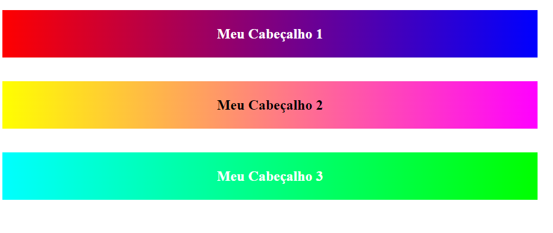

# Projeto

Realizar a criação de um component usando JavaScript puro.
Nesse projeto foi importante para ajudar a entender DOM, SHADOW DOM e VIRTUAL DOM.

## Requisitos
O criado foi o "component-header" utilizando JavaScript Vanilla e o mesmo recebeu os seguintes parâmetros:
<ul>
  <li>color-text</li>
  <li>first-color (back-ground)</li>
  <li>second-color (back-ground)</li>
  <li>title</>

A renderização está na imagem. 
